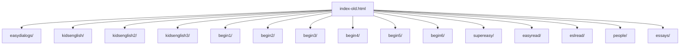

# File-Level Wiring Report

## Purpose

This is the first-pass wiring map for the repo. It combines:

- package tooling wiring from `package.json`
- the JavaScript dependency graph from `dependency-cruiser`
- the site's HTML-to-asset wiring that drives the reading trees

The site is still mostly static content, so the useful wiring is not a framework graph. It is a file graph: HTML pages, shared asset roots, Local script helpers, and a few legacy edges that should stay excluded.

## Package Layer

`package.json` is tooling-only right now. It does not define a build pipeline, just dev dependencies for:

- `dependency-cruiser`
- `playwright`
- `axe-core`
- `cheerio`
- `archiver`
- ESLint packages

`package-lock.json` is the lockfile for the same tooling set.

## JS Wiring First Pass

I ran `dependency-cruiser` against the local JS and config layer with no config file, then added a repo config for repeatability.

Observed local modules in the first pass:

- `eslint.config.mjs`
- `scripts/dict_original.js`
- `scripts/experimental-hotpotato.js`
- `scripts/extract-inline-css.js`

First-pass result:

- no local JS-to-JS edges were found in that scan
- the repo's JS is mostly standalone helpers rather than a dependency graph
- the real wiring is in HTML references, not imports

### JS Diagram

```mermaid
flowchart TD
  pkg[package.json] --> lock[package-lock.json]
  pkg --> depcruise[dependency-cruiser]
  pkg --> playwright[playwright]
  pkg --> axe[axe-core]
  pkg --> cheerio[cheerio]
  pkg --> archiver[archiver]

  eslintcfg[eslint.config.mjs] --> eslintjs[@eslint/js]
  eslintcfg --> globals[globals]
  eslintcfg --> eslintjson[@eslint/json]
  eslintcfg --> eslintmd[@eslint/markdown]
  eslintcfg --> eslintcss[@eslint/css]
  eslintcfg --> eslintconfig[eslint/config]

  inlinecss[scripts/extract-inline-css.js] --> fs[fs]
  inlinecss --> path[path]
  inlinecss --> archiver
  inlinecss --> cheerio

  dict[scripts/dict_original.js]
  hotpotato[scripts/experimental-hotpotato.js]
```

## Reading Content Wiring

The content roots are self-contained reading folders. `index-old.html` is the link map that points to them.

### Root Content Trees



## Shared Asset SSOTs

These are the shared roots that multiple reading trees reference:

- `style/style.css`
- `pics/favicon.png`
- `pics/backgroud.webp`
- `audio/`
- `images/`

Keep these centralized. Do not duplicate them into every reading folder unless a page explicitly overrides a file locally.

## Cross-Folder File Wiring

These are the important file-level links that centralize shared behavior:

- `easydialogs/*.html` -> `../style/style.css`
- `easydialogs/*.html` -> `../pics/favicon.png`
- `easydialogs/*.html` -> `audio/`
- `easydialogs/*.html` -> `images/`
- `easydialogs/ec/` -> `ec/css/`
- `begin2/` -> `b2/css/`
- `begin4/` -> `b4/css/`
- `begin5/` -> `b5/css/`
- `kidsenglish*/` -> local `audio/`, `cloze/`, `dict/`, `pics/`, `sent/`, `w*/`
- `begin1/` through `begin6/` -> local `audio/`, `cloze/`, `dict/`, `pics/`, `sent/`, `w*/`
- `supereasy/` -> local `audio/`, `dict/`, `images/`, `se/`, `secloze/`, `semx/`, `sewords/`
- `easyread/` -> local `audio/`, `dict/`, `ecloze/`, `ecross/`, `emx/`, `es/`, `ewords/`, `images/`
- `eslread/`, `people/`, `essays/` -> local `audio/`, `cloze/`, `comp/`, `dict/`, `pics/`, `words/`

## Legacy / Orphan Edges

These should not be treated as runtime wiring for the rsync mirror:

- `robot/` is excluded entirely
- `style/style.css.bu` is a backup/orphan
- `begin2/b2/vnu.jar` and `begin3/b3/vnu.jar` are validator artifacts, not runtime assets
- `begin6/dict/1. The Hairstyle Change.html` references `assets/bootstrap.min.css` and `assets/bootstrap.min.js`, but there is no matching runtime `assets/` tree in the linked roots

## Findings

### Orphans

The current scan shows these clear orphan or non-runtime files:

- `style/style.css.bu`
- `supereasy/style.css.old`
- `images/icons/icomoon.zip`
- `images/icons/icomoon/svgxuse.js`
- `needed.css`
- `dict improvements.txt.css`
- `inline_styles.log`
- `dead_classes.log`
- `begin2/b2/vnu.jar`
- `begin3/b3/vnu.jar`
- `begin1/audio/b1053v1.mp3.html.7z`
- `begin1/audio/d/_notes`
- the many `_notes`, `_vti_cnf`, `.old`, `.older`, `.log`, `.zip`, and `.7z` files under the reading trees

`AboutPageAssets/` is only referenced by `robot/starters_reading_01.html`, so if `robot/` stays out of scope, `AboutPageAssets/` is effectively orphaned for the mirror.

### Bad Links

- There are `10,747` local references to `purl.org/dc/elements/1.1/index.html` across the HTML corpus, but no matching local `purl.org/` tree exists in the repo. That is a broken local link pattern, even if it was originally meant as a schema hint.
- `begin6/dict/1. The Hairstyle Change.html` points at `assets/bootstrap.min.css` and `assets/bootstrap.min.js`, but there is no live `assets/` tree under the reading roots.

### Centralization Opportunities

- `style.css` at the repo root is a one-off legacy stylesheet used by `index-old.html`. The rest of the site uses `style/style.css`. That is the clearest stylesheet SSOT split.
- `pics/favicon.png` is the shared favicon SSOT. Keep it centralized rather than copying per-tree.
- `pics/backgroud.webp` is a shared background asset consumed by both `style.css` and `style/style.css`.
- `audio/` is a shared content bucket and should remain centralized.
- `images/` is a shared bucket, while `images/icons/icomoon/` is the sprite SSOT used by the current homepage.
- `begin2/b2/css/`, `begin4/b4/css/`, `begin5/b5/css/`, and `easydialogs/ec/css/` are local one-offs that should stay with their owning tree unless you deliberately refactor them into a shared layer.

### One-Offs

- `index-old.html` is the only page still pointing at root-level `style.css`.
- `robot/` is a separate subsite and has its own asset assumptions, but it is out of the graded-reading mirror scope.
- `begin6/dict/1. The Hairstyle Change.html` is the only page I found with the stale `assets/bootstrap.*` dependency.

## Summary

The repo wiring is mostly:

1. `package.json` for tooling
2. `index-old.html` for content root discovery
3. shared asset roots for true SSOT files
4. per-folder reading trees for self-contained content

The first-pass graph is flat on the JS side. The real dependency load is in the HTML asset layer.
